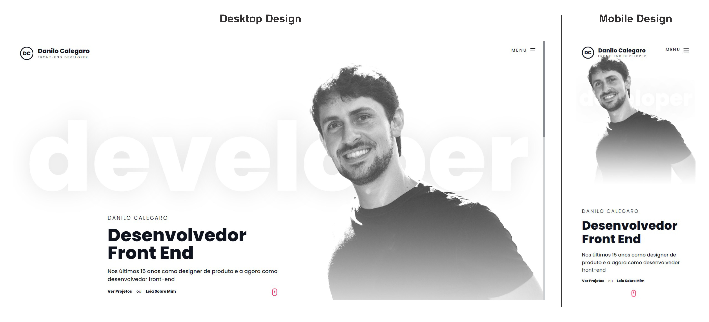

# Web Portfólio Danilo


🚀 *Evolução constante*

<hr>

 ### Tabela de conteúdos

- [Web Portfólio Danilo](#web-portfólio-danilo)
    - [Tabela de conteúdos](#tabela-de-conteúdos)
  - [Visão Geral](#visão-geral)
    - [A Página](#a-página)
    - [Captura de Tela](#captura-de-tela)
    - [Links](#links)
  - [Meu Processo](#meu-processo)
    - [Recursos utilizados](#recursos-utilizados)
  - [Pré-requisitos](#pré-requisitos)
  - [Autor](#autor)

## Visão Geral
### A Página

Este é o projeto do meu Web Portfólio que consiste em uma aplicação construída em NextJs com os conceitos aprendidos em minha caminhada.

Construído no estilo de design minimalista e totalmente responsivo para qualquer pessoa acessar no dispositivo e no momento que desejar. 

O minimalismo não é falta de algo, é simplesmente a quantidade exata de alguma coisa. Não diz respeito ao uso de poucos componentes e estilos da composição, mais sim ao máximo aproveitamento dele em si, em conjunto com o apelo estético da aplicação. 

### Captura de Tela

### Links

- URL da Solução : [danilocalegaro.dev.br](https://danilocalegaro.dev.br/)

## Meu Processo
Tudo iniciou com a proposta de construir algo simples e objetivo. O estilo minimalista foi o método ideal para o projeto pois todas a informações que eu queria transmitir ficou muito clara e foi possível criar um esboço.

Com a base criada, o próximo passo foi a implementação de todo o projeto em NextJS com o `css-in-js` usando Styled-Components, mais com o detalhe de ele ser totalmente responsivo as diversas resoluções, assim nasceu um desafio, independente da resolução a página inicial teria que ser a mesma, mais isso foi resolvido com o cálculo `vh` com `margin-top` no css para sempre deixar o elemento na posição desejada.

Após criado todo *landing page* fui em busca da animação perfeita, eu queria algo suave, sem muito efeitos, assim descobri o [Motion-Frame](https://www.framer.com/motion/) que é uma biblioteca de movimento para ReactJS que possui uma sintaxe declarativa muito simples, foi uma ótima oportunidade de aprender.

Outro detalhe para todo o portfólio é necessário ter algo dedicada as pessoas enviarem sua mensagem além das redes sociais, para isso surgiu a necessidade de criar uma página de contato. Construindo esta página descobri o [EmailJS](https://www.emailjs.com/) uma ótima ferramenta de envios de e-mails diretamente do JavaScript sem nenhum código de servidor necessário. Mergulhei em sua documentação e montei toda a conexão com API de serviço e ficou excelente, agora qualquer mensagem enviada do portfólio chegará em meu e-mail.

No formulário de contato foi utilizado o [React Hook Form](https://react-hook-form.com/) juntamente com [YUP](https://github.com/jquense/yup) para validação dos campos.

Contudo foram várias semanas para desenvolvimento e grandes desafios que foram superados, muito ainda pode ser melhorado, por isso a evolução é constante.

### Recursos utilizados

- [yarn](https://yarnpkg.com/) - Gerenciador de pacotes do projeto.
- [NextJS](https://nextjs.org/) - Framework React.
- [TypeScrip](https://www.typescriptlang.org/) - Uma linguagem de programação fortemente tipada que se baseia em JavaScript.
- [EmailJS](https://www.emailjs.com/) - Animações de movimento.
- [React Hook Form](https://react-hook-form.com/) - Validação dos campos do formulário.
- [YUP](https://github.com/jquense/yup) - Construtor de esquema para análise e validação
- [EmailJS](https://www.emailjs.com/) - Envios de e-mails diretamente do JavaScript
- [Rocketseat - Ignite](https://www.rocketseat.com.br/ignite) - Estudos de ReactJS/NextJS

## Pré-requisitos

Para visualizar a página hospedada basta clicar no link disponível acima nesta página.

Para executar o projeto *local* utilizamos os comandos:
> yarn install

Será nacessario criar na raiz do projeto um arquivo `.env.local` com as chaves criadas pelo EmailJS, este arquivo deverá ter o seguinte código: 

````
NEXT_PUBLIC_REACT_APP_SERVICE_ID = 'seu id service emailjs'

NEXT_PUBLIC_REACT_APP_TEMPLATE_ID = 'seu id templete emailjs'

NEXT_PUBLIC_REACT_APP_USER_ID = 'seu id publico emailjs'
````

Para qualquer dúvida a documentação por ser acessada neste link [www.emailjs.com/docs/](https://www.emailjs.com/docs/) ou neste outro link com um ótimo exemplo passo a passo [How to send emails using React through EmailJs](https://victorbruce82.medium.com/how-to-send-emails-using-react-through-emailjs-no-server-code-needed-8e1453ef8796)

Logo em seguida:

> yarn run dev
> 
E a aplicação poderá ser visualizada nas suas respectivas rotas:

`http://localhost:3000/`
`http://localhost:3000/contact`


## Autor

Danilo Calegaro - [danilocalegaro.dev.br](https://danilocalegaro.dev.br/)